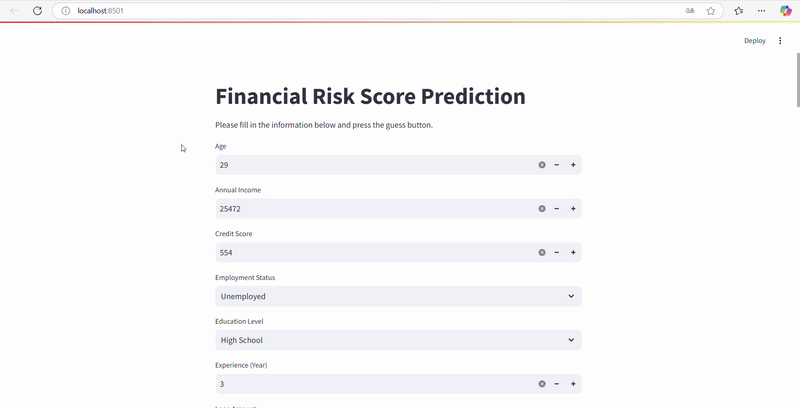

# Financial-Risk-Score-Prediction
A Financial Risk Score is a numerical representation of a customer's potential risk to a lender. It helps banks, financial institutions, and credit agencies assess the likelihood that a customer will default on a loan or default on their financial obligations. 

### The following processes were followed in this project:

#### 1) Data Collection:
Data was taken from Kaggle

#### 2) Data Preprocessing:
- Determination of categorical and numerical features
- Feature engineering
- Numericalization of categorical data (Ordinal Encoding and One-Hot Encoding)
- Normalization (Standard Scaler)

#### 3) Model Selection and Training:

- XGBoost hyperparameter optimization
- LightGBM hyperparameter optimization
- CatBoost hyperparameter optimization
- Establishing an ensemble model (VotingRegressor)
- MLflow and Dagshub for monitoring, version control, and deployment of machine learning models.

#### 4) Model Evaluation:
- Performance analysis with metrics such as "Mean Squared Error", "Root Mean Squared Error", "Mean Absolute Error", "R2 Score".

#### 5) API:
- Creating an API with fastapi framework.

#### 6) Test:
- PEP 8 code style checking with Flake8
- Unit Testing with pytest

#### 7) CI/CD
- Creating CI/CD with Github Actions.

#### 8) Web Application
- Creating an interactive web interface using Streamlit.
- Connecting the frontend to the backend API.
- Integrating a database for data storage.

#### 9) Containerization:
- Containerizing the application using Docker.
- Creating Dockerfiles for the API, web application.
- Managing services with Docker Compose.
- Ensuring portability and scalability of the application.


## Installation

Clone the repository:
```bash
git clone https://github.com/hakankocakk/Financial-Risk-Score-Prediction.git
```

Install dependencies:
```bash
pip install -r requirements.txt
```

Remove git tracking from src/model folder:
```bash
git rm -r --cached 'src/model'
```

Run the pipeline:
```bash
dvc repro
```

Show model performance
```bash
dvc metrics show
```

### Testing the model with API
Start FastAPI application:
```bash
uvicorn src.api.main:app --reload
```
Open API documentation page:
[API Documentation](http://127.0.0.1:8000/docs)  

Sending a POST request:
Click the `POST` button and then the `Try it out` button.  
```bash
{
  "Age": 29,
  "AnnualIncome": 25472,
  "CreditScore": 554,
  "EmploymentStatus": "Unemployed",
  "EducationLevel": "High School",
  "Experience": 6,
  "LoanAmount": 33556,
  "LoanDuration": 96,
  "MaritalStatus": "Divorced",
  "NumberOfDependents": 2,
  "HomeOwnershipStatus": "Rent",
  "MonthlyDebtPayments": 326,
  "CreditCardUtilizationRate": 0.2177267391395128,
  "NumberOfOpenCreditLines": 3,
  "NumberOfCreditInquiries": 3,
  "DebtToIncomeRatio": 0.2341003397518907,
  "BankruptcyHistory": 1,
  "LoanPurpose": "Debt Consolidation",
  "PreviousLoanDefaults": 0,
  "PaymentHistory": 23,
  "LengthOfCreditHistory": 4,
  "SavingsAccountBalance": 2126,
  "CheckingAccountBalance": 1786,
  "TotalAssets": 86090,
  "TotalLiabilities": 70131,
  "MonthlyIncome": 2122.6666666666665,
  "UtilityBillsPaymentHistory": 0.8531373012798046,
  "JobTenure": 9,
  "NetWorth": 15959,
  "BaseInterestRate": 0.291556,
  "InterestRate": 0.2668631846019597,
  "MonthlyLoanPayment": 849.0157407209754,
  "TotalDebtToIncomeRatio": 0.553556410515535
}
```
Add this text and click `Execute` button:  
You can see the prediction result in the `Response body` section.

In the terminal where you are running the API application, stop the API by pressing `CTRL + C`.

### Testing the Web Application

Start FastAPI application:
```bash
uvicorn src.api.main:app --reload
```

Replace this code in `app/streamlit_app.py` file with the following code.
```python
response = requests.post(
    "http://fastapi:8000/prediction", data=json.dumps(input_data)
)
```

```python
response = requests.post(
    "http://127.0.0.1:8000/prediction", data=json.dumps(input_data)
)
```

Start the web application.
```bash
streamlit run app/streamlit_app.py
```


### Testing the Web Application with Docker

Creating Docker images
```bash
docker-compose build
```

Start Container
```bash
docker-compose up
```
Open web application page:  
[Web Application](http://localhost:8001/)  


#### Demo:



### **About the Developer**
- Hakan KOCAK


